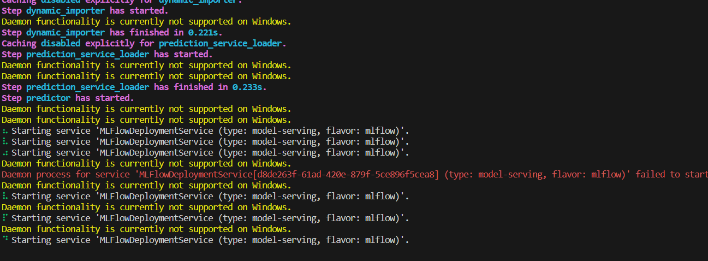

Hi, There. I belive you probably cam here after my post on Stack Overflow. This is my first Mlops project and i have been stuck due to the 
erroe "Daemon functionality not available on Windows". I have tried searching for an workaround for 2 days now but no solution was found. 
If there is any work around please let me know. Thank you for your time and support.  

